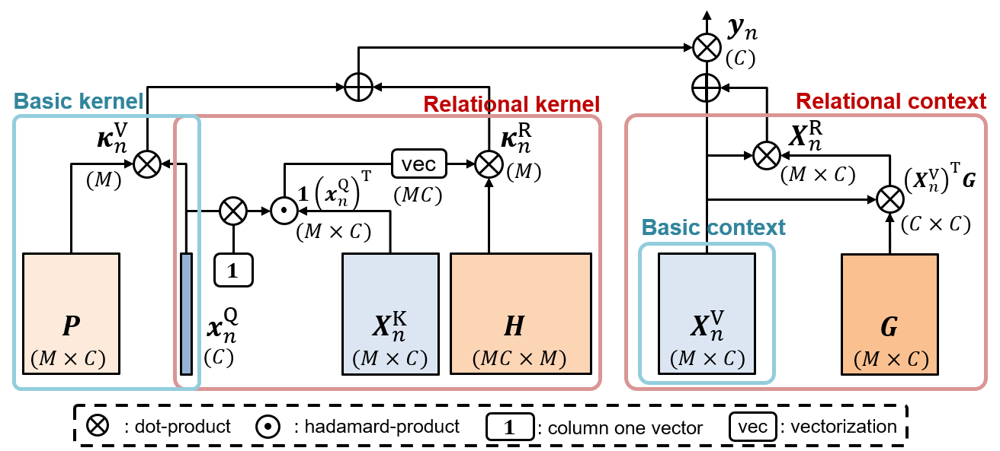

# Relational Self-Attention: What's Missing in Attention for Video Understanding

This repository is the official implementation of "Relational Self-Attention: What's Missing in Attention for Video Understanding" by Manjin Kim*, Heeseung Kwon*, Chunyu Wang, Suha Kwak, and Minsu Cho (* equal contribution). 

***
</img>
***

## Requirements

* Python: 3.7.9
* Pytorch: 1.6.0
* TorchVision: 0.2.1
* Cuda: 10.1
* Conda environment [environment.yml](./environment.yml)


To install requirements:

```setup
    conda env create -f environment.yml
    conda activate rsa
```

## Dataset Preparation

1. Download Something-Something v1 & v2 (SSv1 & SSv2) datasets and extract RGB frames.
    Download URLs: [SSv1](https://20bn.com/datasets/something-something/v1), [SSv2](https://20bn.com/datasets/something-something/v2)
2. Make txt files that define training & validation splits. Each line in txt files is formatted as [video_path] [#frames] [class_label]. Please refer to any txt files in ./data directory.

## Training

To train RSANet-R50 on SSv1 or SSv2 datasets in the paper, run this command:

```train
    # For SSv1
    ./scripts/train_Something_v1.sh <run_name> <num_frames>
    # example: ./scripts/train_Something_v1.sh RSA_R50_SSV1_16frames 16
    
    # For SSv2
    ./scripts/train_Something_v2.sh <run_name> <num_frames>
    # example: ./scripts/train_Something_v2.sh RSA_R50_SSV2_16frames 16
```


## Evaluation

To evaluate RSANet-R50 on SSv2 dataset in the paper, run:

```eval
    # For SSv1
    ./scripts/test_Something_v1.sh <run_name> <ckpt_name> <num_frames>
    # example: ./scripts/test_Something_v1.sh RSA_R50_SSV1_16frames resnet_rgb_model_best.pth.tar 16
    
    # For SSv2
    ./scripts/test_Something_v2.sh <run_name> <ckpt_name> <num_frames>
    # example: ./scripts/test_Something_v2.sh RSA_R50_SSV2_16frames resnet_rgb_model_best.pth.tar 16
```


## Results

Our model achieves the following performance on [Something-Something-V1](https://paperswithcode.com/sota/action-recognition-in-videos-on-something-1) and [Something-Something-V2](https://paperswithcode.com/sota/action-recognition-in-videos-on-something):

| Model name         | # frames |SSv1 Top-1 / Top-5  | SSv2 Top-1 / Top-5 |
| ------------------ |----------|------------| -------------- |
| RSANet-R50  |  16      |   54.0 % / 81.1 % [[logs]](./logs/RSA_R50_SSV1_16frames.log) [[checkpoints]](https://drive.google.com/drive/folders/1kiMGDdQnNtd0YF6s0MTDVRy6IAvyWpZ9?usp=sharing) |      66.0 % / 89.9 % [[logs]](./logs/RSA_R50_SSV2_16frames.log) [[checkpoints]](https://drive.google.com/drive/folders/1duRFSAJEJ1Qkd19tsrug_bBB056XVSgf?usp=sharing) |


## Qualitative Results

</img>
